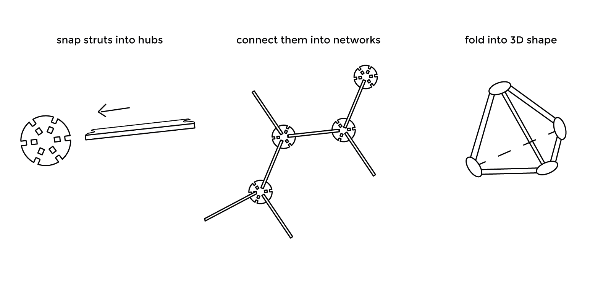
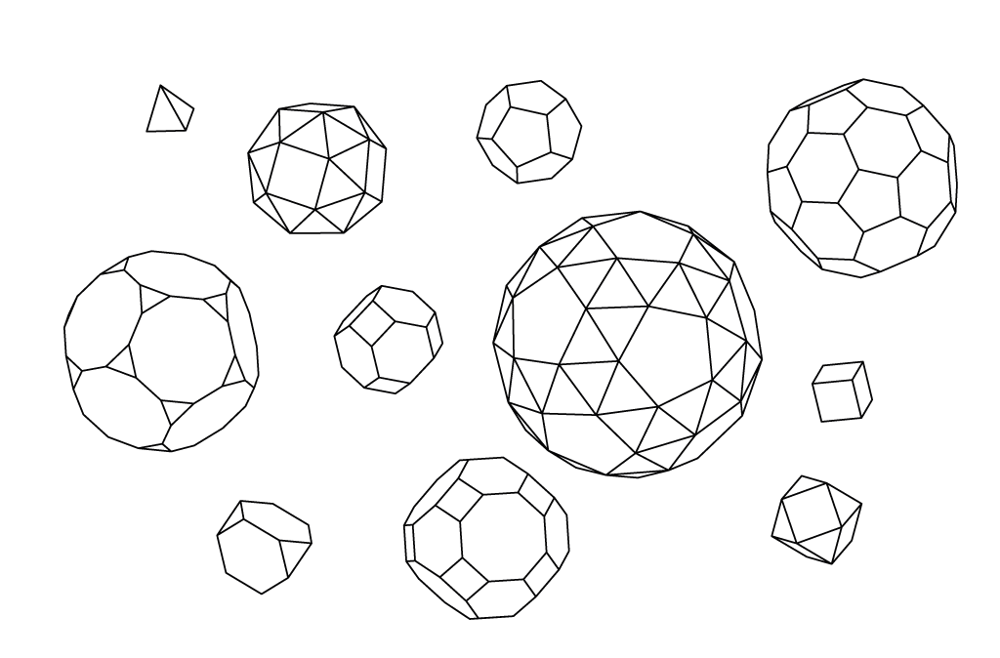

# trispace v.0.1

trispace is laser cut maker kit that can be used to create just about anything geometric - sculptures, toys, buildings and prototypes. It is open source and modular. 


## Index

- [Instructions](#instructions)
* [Materials](#materials)
* [Tolerances](#tolerances)
* [Shapes](#shapes)
* [Files](#files)
* [License](#license)


## Instructions

Please read all instructions carefully before starting to cut anything. 


1. **Come up with an idea.** You might be attempting to build a particular object, shape, or just cut the set to play and prototype. Check out [shapes](#shapes) section for the inspiration. 
2. **Do the math.** Try to figure out amount of struts and hubs needed for your idea. For instance cube needs only 8 hubs and 12 struts.
3. **Choose material.** Read the section about materials, choose the right material for the job, pay attention to [tolerances](#tolerances). 
4. **Download files.** Find the right files in the 'files' folder.
5. **Test the connection.**  Make sure you test the connection by cutting one hub and one strut (use individual part files) and trying to connect them. It should snap on and off with little effort, move in one axis 180 degrees freely. 
6. **Cut the parts.** Be environmentally friendly. trispace is designed to do more with less, embrace the idea and cut minimal amount of parts. You can reuse the same parts in many shapes.
7. **Assemble model.** Don't apply force, especially to 3mm plywood. Connections snap best when struts is parralel or perpendicular to the hubs. See Picture below. Freshly cut plywood is better to handle with in gloves. 





## Materials 

* 3mm laser grade plywood 
* 6mm laser grade plywood
* 3mm Acrylic - **can be used only for the hubs!**


## Tolerances 

##### Laser cutter 
All parts from the parts supplied has been tested on the Epilog - Mini 24 Laser Cutter with the kerf approximately 0.2mm. If you're using different type of laser cutter you should test one connection first before cutting multiple parts. 

##### Plywood thickness 

3mm marked plywood can vary in thickness from 2.7mm up to 3.2mm. Parts are designed with high precision to snap nicely together and allow for only a bit of discrepancy. If you're cutting 3mm plywood choose the sheets between 2.8mm-3.0mm. 
If you're cutting 6mm plywood parts choose between 5.8mm - 6.0mm.  


## Shapes 

Due to a flexible connection between hub and strut, trispace kit is incredibly versatile. With just one type of hub and strut you can make the majority of [Platonic](http://en.wikipedia.org/wiki/Platonic_solid) and [Archimedian](http://en.wikipedia.org/wiki/Archimedean_solid) solids. 

All the shapes from the image below (not at the same time of course) are possible from those files laser cutted once

```
3mm_6x_hubs_300x600_sheet
3mm_struts_300x600_sheet
```



**!tip:** Wikipedia tells you how many struts(Edges) and hubs(Vertices) do you need for a particular solid. 


The rest of [Platonic](http://en.wikipedia.org/wiki/Platonic_solid) and [Archimedian](http://en.wikipedia.org/wiki/Archimedean_solid) along with the most of [Jonson](http://en.wikipedia.org/wiki/Johnson_solid) solids are possible if you start using 4x, 5x hubs (single hubs are included in the files). 

#### coming soon

Theoretically with greater number of connections on the hub [Kepler–Poinsot polyhedron](http://en.wikipedia.org/wiki/Kepler%E2%80%93Poinsot_polyhedron) would be possible to build with the trispace kit. (planning to test it soon)

Buckminster Fuller [Geodesic Dome](http://en.wikipedia.org/wiki/Geodesic_dome) is possible to make with more the variation of struts length (not included in the files yet), and hubs angles. Length and and angles can be calculated with this tool [www.acidome.ru](http://acidome.ru/lab/calc/#7/12_Cone_3V_R4.2_beams_150x50)


## Files

There are multiple files created and tested for different materials and scales. Below is the overview of the folder structure. Depending on your idea you might need to combine many individual parts on one sheet or you can use the sheets filled with one part for the quickest cutting path with the least waste. 

[Download Files](files)

```
files/
├── 3mm_plywood
|  	├── hubs  
│   │	├── 3mm_4x_hub_single
│   │	├── 3mm_5x_hub_single
│   │	├── 3mm_6x_hub_single
│   │	└── 3mm_6x_hubs_300x600_sheet
│   ├── struts
│   │	├── 3mm_strut_single
│   │	├── 3mm_strut_single_transitional
│   │	└── 3mm_struts_300x600_sheet
│   ├── other parts
│   │	├── 3mm_5x_lamp_holder_single
│   │	└── 3mm_6x_lamp_holder_single
├── 6mm_plywood/
|  	├── hubs  
│   │	├── 6mm_4x_hub_single
│   │	├── 6mm_5x_hub_single
│   │	├── 6mm_6x_hub_single
│   │	└── 6mm_6x_hubs_300x600_sheet
│   ├── struts
│   │	├── 6mm_strut_single
│   │	├── 6mm_strut_single_transitional
│   │	└── 6mm_struts_300x600_sheet
└── 3mm_acrylic/
    ├── 3mm_5x_hub_single
    ├── 3mm_6x_hub_single
    └── 3mm_6x_hubs_300x600_sheet
```


## License 

This design is offered to make for non-commercial use under the terms of the following license: 
[Creative Commons - Attribution-NonCommercial-ShareAlike 4.0 International](https://creativecommons.org/licenses/by-nc-sa/4.0/).


If you would like to use the design for anything not defined by this license please get in touch via this [contact form](http://opendesignschool.co.uk/contact/)

