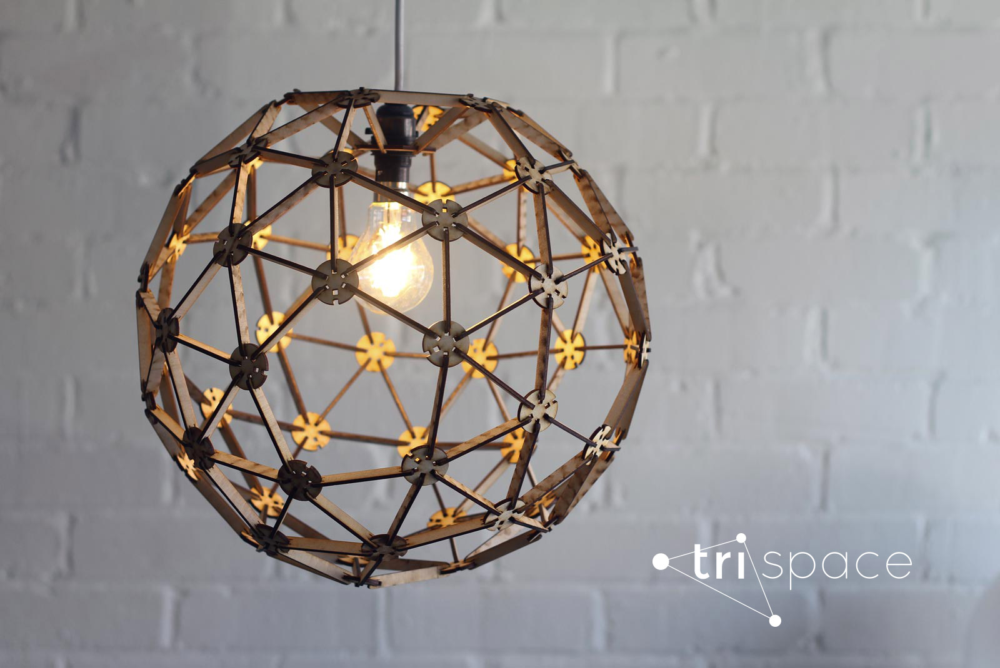

# trispace v.0.1

trispace is laser cut maker kit that can be used to create just about anything geometric - sculptures, toys, buildings and prototypes. It is open source and modular. 


## Index

* Instructions
* Materials
* Tolerances
* Cutting files
* Products examples
* trispace elswhere
* License


## Instructions

Please read all instructions carefully before starting to cut anything. 


1. **Come up with an idea.** You might be attempting to build a particular object, shape, or just cut the set to play and prototype. Check out shapes section for the inspiration. 
2. **Do the math.** Try to figure out amount of struts and hubs needed for your idea. For instance cube needs only 8 hubs and 12 struts.  
3. **Choose material.** Read the section about materials, choose the right material for the job, pay attention to tolerances. 
4. **Download files.** Find the right files in the 'cutting files' folder. Study folder structure beforehand.
5. **Test the connection.**  Make sure you test the connection by cutting one hub and one strut (use individual part files) and trying to connect them. It should snap on and off with little effort, move in one axis 180 degrees freely. 
6. **Cut the parts.** Be environmentally friendly. trispace is designed to do more with less, embrace the idea and cut minimal amount of parts.
7. **Assemble model.** Don't apply force, especially to 3mm plywood. Connections snap best when struts is parralel or perpendicular to the hubs. Freshly cut plywood is better to handle with in gloves. 


## Materials 

* 3mm laser grade plywood 
* 6mm laser grade plywood
* 3mm Acrylic - **can be used only for the hubs!**


## Tolerances 

##### Laser cutter 
All parts from the parts supplied has been tested on the Epilog - Mini 24 Laser Cutter with the kerf approximately 0.2mm. If you're using different type of laser cutter you should test one connection first before cutting multiple parts. 

##### Plywood thickness 

3mm marked plywood can vary in thickness from 2.7mm up to 3.2mm. Parts are designed with high precision to snap nicely together and allow for only a bit of discrepancy. If you're cutting 3mm plywood choose the sheets between 2.8mm-3.0mm. 
If you're cutting 6mm plywood parts choose between 5.8mm - 6.0mm.  


## Cutting Files

There are multiple files created and tested for different materials and scales. Below is the overview of the folder structure. Depending on your idea you might need to combine many individual parts on one sheet or you can use the sheets filled with one part for the quickest cutting path with the least waste. 

```
files/
├── 3mm_plywood
|  	├── hubs  
│   │	├── 3mm_4x_hub_single
│   │	├── 3mm_5x_hub_single
│   │	├── 3mm_6x_hub_single
│   │	└── 3mm_6x_hubs_300x600_sheet
│   ├── struts
│   │	├── 3mm_strut_single
│   │	├── 3mm_strut_single_transitional
│   │	└── 3mm_struts_300x600_sheet
│   ├── other parts
│   │	├── 3mm_5x_lamp_holder_single
│   │	└── 3mm_6x_lamp_holder_single
├── 6mm_plywood/
|  	├── hubs  
│   │	├── 6mm_4x_hub_single
│   │	├── 6mm_5x_hub_single
│   │	├── 6mm_6x_hub_single
│   │	└── 6mm_6x_hubs_300x600_sheet
│   ├── struts
│   │	├── 6mm_strut_single
│   │	├── 6mm_strut_single_transitional
│   │	└── 6mm_struts_300x600_sheet
└── 3mm_acrylic/
    ├── 3mm_5x_hub_single
    ├── 3mm_6x_hub_single
    └── 3mm_6x_hubs_300x600_sheet
```


## License 

This design is offered to make for non-commercial use under the terms of the following license: 
[Creative Commons - Attribution-NonCommercial-ShareAlike 4.0 International](https://creativecommons.org/licenses/by-nc-sa/4.0/).


If you would like to use the design for anything not defined by this license please get in touch via this [contact form](http://opendesignschool.co.uk/contact/)

